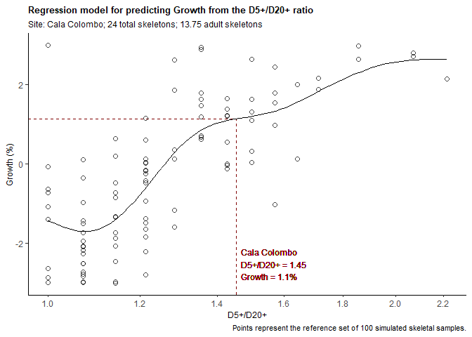

# demrat

Provides a framework for estimating demographic rates (growth, crude
birth, and total fertility rate) of a population represented by a
skeletal sample(s) using age-at-death ratios.

The methodology accounts for the effect of stochastic variation in small
skeletal samples and allows to set a reference mortality pattern
appropriate for the time period being studied.

## Shiny web application

[Shiny app for the `demrat`
package](https://galetap.shinyapps.io/demrat/) enables to deploy
demographic predictions using `demrat` with a point-and-click interface.
The Shiny app is useful for non-R users or for those who want to
experiment with the `demrat` package before downloading it and without
having to read through the documentation below.

## Installation and loading

- Install the latest developmental version from
  [GitHub](https://github.com/galetap/demrat) as follow:

``` r
if(!require(devtools)) install.packages("devtools")
devtools::install_github("galetap/demrat")
```

- Loading package(s)

``` r
library(demrat)
# The examples below use the `tidyverse` package. If installed, load it by running:
library(tidyverse)
```

## Data

The functions of the package accept data in two formats; summary data
and raw data format.

Two built-in datasets are available: `BA` (summary data format) and
`BAraw` (raw data format). Both datasets are adopted from Bocquet-Appel
(2002), Table 1 (<https://doi.org/10.1086/342429>).

**Summary data format**

The rows of the summary data format contain data for one skeletal
sample. Data must have at least four variables.

1.  Site
2.  Culture
3.  D20\_ (i.e., D20+, number of adult skeletons in a sample)
4.  One out of the following three age-at-death ratios: D1_D20\_,
    D3_D20\_, D5_D20\_ (i.e., D1+/D20+, D3+/D20+, D5+/D20+ ratios,
    respectively).

The column with the total number of skeletons in a sample (named n) is
recommended.

``` r
tibble(Site = c("Site A", "Site B", "Site C"),
       Culture = c("Culture 1", "Culture 1", "Culture 2"),
       D20_ = c(25, 96, 55),
       D5_D20_ = c(1.61, 1.37, 1.27),
       n = c(50, 141, 72))
```

    ## # A tibble: 3 × 5
    ##   Site   Culture    D20_ D5_D20_     n
    ##   <chr>  <chr>     <dbl>   <dbl> <dbl>
    ## 1 Site A Culture 1    25    1.61    50
    ## 2 Site B Culture 1    96    1.37   141
    ## 3 Site C Culture 2    55    1.27    72

*`BA` dataset*

Summary format of Bocquet-Appel’s (2002) dataset.

Each row contains data from a single skeletal sample.

Variables include Site and Culture name, absolute chronology of the
Site, number of skeletons in various age-at-death categories, and
age-at-death ratio values.

``` r
BA
```

    ## # A tibble: 68 × 12
    ##    Site   Front   C14    dt  D0_4 D5_19   D20_     n     P   D5_ D5_D20_ Culture
    ##    <chr>  <int> <int> <int> <dbl> <dbl>  <dbl> <dbl> <dbl> <dbl>   <dbl> <chr>  
    ##  1 Aisne…  5000  4900   100 10    15     25       50 0.375  40      1.6  Neolit…
    ##  2 Aiter…  5400  5300   100  5.4  21.4  115.     142 0.157 137.     1.19 Neolit…
    ##  3 Ajdov…  5500  4394  1106  6     8     11       25 0.421  19      1.73 Neolit…
    ##  4 Aven …  5500  3176  2324  3.2   7.8   49       60 0.137  56.8    1.16 Neolit…
    ##  5 Bade-…  5400  5250   150  7.2  12.8   11       31 0.538  23.8    2.16 Neolit…
    ##  6 Baume…  5500  4700   800  1.75  3.91   9.33    15 0.295  13.2    1.42 Neolit…
    ##  7 Belle…  4900  2548  2352  9.8  35.6   95.6    141 0.272 131.     1.37 Neolit…
    ##  8 Breui…  4900  2700  2200 28    20     40       88 0.333  60      1.5  Neolit…
    ##  9 Broch…  5900  3900  2000  2    15     55       72 0.214  70      1.27 Neolit…
    ## 10 Bruch…  5400  5250   150  8.2  18.8   34       61 0.356  52.8    1.55 Neolit…
    ## # … with 58 more rows

``` r
# For column description, run help(BA).
```

**Raw data format**

The rows of the raw data format contain data for one skeleton. Data must
contain at least four variables.

1.  Site
2.  Culture
3.  Age_min; lower limit of the age-at-death estimate of a skeleton
4.  Age_max; upper limit of the age-at-death estimate of a skeleton

Note that the age-at.death intervals are closed on the left and open on
the right. It is, interval from 20 to 40 means that individual died
between 20 and 39.9 years of age.

``` r
# First 10 rows only
tibble(Site = rep("Site A", 10),
       Culture = rep("Culture 1", 10),
       Age_min = c(20, 0, 40, 3, 9, 20, 1, 20, 19, 60),
       Age_max = c(40, 1, 60, 5, 12, 39, 2, 100, 21, 100))
```

    ## # A tibble: 10 × 4
    ##    Site   Culture   Age_min Age_max
    ##    <chr>  <chr>       <dbl>   <dbl>
    ##  1 Site A Culture 1      20      40
    ##  2 Site A Culture 1       0       1
    ##  3 Site A Culture 1      40      60
    ##  4 Site A Culture 1       3       5
    ##  5 Site A Culture 1       9      12
    ##  6 Site A Culture 1      20      39
    ##  7 Site A Culture 1       1       2
    ##  8 Site A Culture 1      20     100
    ##  9 Site A Culture 1      19      21
    ## 10 Site A Culture 1      60     100

*`BAraw` dataset*

Raw format of Bocquet-Appel’s (2002) dataset.

``` r
BAraw
```

    ## # A tibble: 5,115 × 4
    ##    Site         Culture   Age_min Age_max
    ##    <chr>        <fct>       <dbl>   <dbl>
    ##  1 Aisne series Neolithic       5      20
    ##  2 Aisne series Neolithic       0       5
    ##  3 Aisne series Neolithic      20     100
    ##  4 Aisne series Neolithic       0       5
    ##  5 Aisne series Neolithic      20     100
    ##  6 Aisne series Neolithic      20     100
    ##  7 Aisne series Neolithic      20     100
    ##  8 Aisne series Neolithic       5      20
    ##  9 Aisne series Neolithic       5      20
    ## 10 Aisne series Neolithic      20     100
    ## # … with 5,105 more rows

``` r
# For column description, run help(BAraw).
```

## Key functions

#### `dr`: Translate raw to summary data format

Based on the raw data format, the function calculates

- number of skeletons in several age-at-death groups (e.g., D1+, D20+)
  and
- six demographic ratios (D1+/D20+, D3+/D20+, D5+/D20+, D5-14/D20+ aka
  juvenility index, D5-19/D5+ aka P index, and D0-14/D0+) by Site and
  Culture.

The function can be applied for one or more Sites.

``` r
dr(BAraw)
```

    ## # A tibble: 68 × 18
    ##    Site      Culture     n    D0   D1_   D3_   D5_  D15_ D0_14 D5_14 D5_19  D20_
    ##    <chr>     <fct>   <dbl> <dbl> <dbl> <dbl> <dbl> <dbl> <dbl> <dbl> <dbl> <dbl>
    ##  1 Aisne se… Neolit…    50   2    48    44      40  30   20    10       15    25
    ##  2 Aiterhof… Neolit…   141   1   140   138     136 122   19    14       21   115
    ##  3 Ajdovska… Neolit…    25   1.2  23.8  21.4    19  13.7 11.3   5.33     8    11
    ##  4 Aven de … Neolit…    60   0.6  59.4  58.2    57  51.7  8.33  5.33     8    49
    ##  5 Bade-Wut… Neolit…    31   1.4  29.6  26.8    24  15.3 15.7   8.67    13    11
    ##  6 Baume Bo… Neolit…    15   0.4  14.6  13.8    13  10.3  4.67  2.67     4     9
    ##  7 Bellevil… Neolit…   142   2   140   136     132 108   34    24       36    96
    ##  8 Breuil-e… Neolit…    88   5.6  82.4  71.2    60  46.7 41.3  13.3     20    40
    ##  9 Brochtor… Neolit…    72   0.4  71.6  70.8    70  60   12    10       15    55
    ## 10 Bruchste… Neolit…    61   1.6  59.4  56.2    53  40.3 20.7  12.7     19    34
    ## # … with 58 more rows, and 6 more variables: D1_D20_ <dbl>, D3_D20_ <dbl>,
    ## #   D5_D20_ <dbl>, JI <dbl>, P <dbl>, D0_14_D0_ <dbl>

#### `diest`: Estimates demographic rates for skeletal sample(s)

`diest` function estimates growth, crude birth, and total fertility
rates based on age-at-death ratios (e.g., D5+/D20+) by Site and Culture.
The function accepts data in the summary format.

The function can be applied for one or more Sites.

Estimation for sites with a large number of skeletons and/or estimation
for many sites can be slow.

**`diest` with default settings based on summary data format**

By default, the prediction model is based on the reference set of 100
simulated reference skeletal samples

- that have the same number of adult skeletons (D20+) as the real
  skeletal sample under study
- that are drawn from reference populations with life expectancies
  between 18 and 25 years and subjected to an annual growth between −3
  and 3% per annum.

``` r
BA %>%
  # Subset two sites only
  slice(12, 24) %>%
  # Predict demographic rates
  diest()
```

    ## # A tibble: 10 × 8
    ##    Site         Culture    DV     IV            Est       Lwr       Upr Ratio_…¹
    ##    <chr>        <chr>      <chr>  <chr>   <dbl[1d]> <dbl[1d]> <dbl[1d]> <chr>   
    ##  1 Cala Colombo Neolithic  TFR    D5_D20_    7.89        4.09    15.2   Normal  
    ##  2 Cala Colombo Neolithic  CBR    D5_D20_   60.8        33.1     88.4   Normal  
    ##  3 Cala Colombo Neolithic  Growth D5_D20_    1.14       -1.14     3.43  Normal  
    ##  4 Cala Colombo Neolithic  CBR    P         58.2        NA       NA     Normal  
    ##  5 Cala Colombo Neolithic  Growth P          1.81       NA       NA     Normal  
    ##  6 Djerdap      Mesolithic TFR    D5_D20_    4.74        3.50     6.43  Normal  
    ##  7 Djerdap      Mesolithic CBR    D5_D20_   38.2        25.0     51.4   Normal  
    ##  8 Djerdap      Mesolithic Growth D5_D20_   -0.799      -1.95     0.349 Normal  
    ##  9 Djerdap      Mesolithic CBR    P         34.4        NA       NA     Normal  
    ## 10 Djerdap      Mesolithic Growth P         -0.0944     NA       NA     Normal  
    ## # … with abbreviated variable name ¹​Ratio_eval

**`diest` with user defined settings of demographic regime of reference
populations**

A demographoc regime (mortality level and annual growth) of a population
from which reference skeletal samples are drawn can be set by the user
(run `help(diest)`).

``` r
BA %>%
  slice(12) %>%
  diest(samples = 200, e0_min = 25, e0_max = 30)
```

    ## # A tibble: 5 × 8
    ##   Site         Culture   DV     IV            Est       Lwr       Upr Ratio_eval
    ##   <chr>        <chr>     <chr>  <chr>   <dbl[1d]> <dbl[1d]> <dbl[1d]> <chr>     
    ## 1 Cala Colombo Neolithic TFR    D5_D20_      7.26     3.74      14.1  Normal    
    ## 2 Cala Colombo Neolithic CBR    D5_D20_     55.0     31.3       78.8  Normal    
    ## 3 Cala Colombo Neolithic Growth D5_D20_      1.57    -0.856      3.99 Normal    
    ## 4 Cala Colombo Neolithic CBR    P           58.2     NA         NA    Normal    
    ## 5 Cala Colombo Neolithic Growth P            1.81    NA         NA    Normal

**`diest` with subsettings dependent and independent variables**

By setting the `IV` and `DV` arguments, a subset of results can be
displayed.

``` r
BA %>%
  slice(12) %>%
  diest(IV="D5_D20_", DV = "TFR")
```

    ## # A tibble: 1 × 8
    ##   Site         Culture   DV    IV            Est       Lwr       Upr Ratio_eval
    ##   <chr>        <chr>     <chr> <chr>   <dbl[1d]> <dbl[1d]> <dbl[1d]> <chr>     
    ## 1 Cala Colombo Neolithic TFR   D5_D20_      7.89      4.09      15.2 Normal

**`diest` with full prediction results**

Full results of the prediction can be obtained by setting `summary=F`.

``` r
BA %>%
  slice(12) %>%
  diest(summary=F)
```

    ## # A tibble: 1 × 4
    ##   Site         Culture   dr_data           DIest           
    ##   <chr>        <chr>     <list>            <list>          
    ## 1 Cala Colombo Neolithic <tibble [1 × 10]> <tibble [5 × 9]>

And further analyzed by `unnest()`.

``` r
BA %>%
  slice(12) %>%
  diest(summary=F) %>% 
  unnest(DIest)
```

    ## # A tibble: 5 × 12
    ##   Site     Culture dr_data  DV    IV    Ref   Glance     Est   Lwr   Upr Ratio…¹
    ##   <chr>    <chr>   <list>   <chr> <chr> <lis> <list>   <dbl> <dbl> <dbl>   <dbl>
    ## 1 Cala Co… Neolit… <tibble> TFR   D5_D… <df>  <tibble>  7.89  4.09 15.2    1.97 
    ## 2 Cala Co… Neolit… <tibble> CBR   D5_D… <df>  <tibble> 60.8  33.1  88.4    1.97 
    ## 3 Cala Co… Neolit… <tibble> Grow… D5_D… <df>  <tibble>  1.14 -1.14  3.43   1.97 
    ## 4 Cala Co… Neolit… <tibble> CBR   P     <df>  <NULL>   58.2  NA    NA      0.491
    ## 5 Cala Co… Neolit… <tibble> Grow… P     <df>  <NULL>    1.81 NA    NA      0.491
    ## # … with 1 more variable: Ratio_eval <chr>, and abbreviated variable name
    ## #   ¹​Ratio_lim

**`diest` based on raw data format**

Raw data format must be converted to summary data format before using
`diest`.

``` r
BAraw %>%
  # Convert raw to summary data format (compute demographic ratios)
  dr() %>% 
  # Select data for two sites
  slice(12, 24) %>%
  # Predict demographic variables
  diest()
```

    ## # A tibble: 22 × 8
    ##    Site         Culture   DV     IV            Est       Lwr       Upr Ratio_e…¹
    ##    <chr>        <fct>     <chr>  <chr>   <dbl[1d]> <dbl[1d]> <dbl[1d]> <chr>    
    ##  1 Cala Colombo Neolithic TFR    D5_D20_    7.63        3.97     14.7  Normal   
    ##  2 Cala Colombo Neolithic TFR    D3_D20_    7.80        4.23     14.4  Normal   
    ##  3 Cala Colombo Neolithic TFR    D1_D20_    6.06        3.56     10.3  Normal   
    ##  4 Cala Colombo Neolithic CBR    D5_D20_   59.3        31.7      87.0  Normal   
    ##  5 Cala Colombo Neolithic CBR    D3_D20_   59.4        33.8      84.9  Normal   
    ##  6 Cala Colombo Neolithic CBR    D1_D20_   49.2        27.1      71.4  Normal   
    ##  7 Cala Colombo Neolithic Growth D5_D20_    1.10       -1.18      3.38 Normal   
    ##  8 Cala Colombo Neolithic Growth D3_D20_    0.937      -1.31      3.18 Normal   
    ##  9 Cala Colombo Neolithic Growth D1_D20_    0.0998     -1.94      2.14 Normal   
    ## 10 Cala Colombo Neolithic CBR    P         56.2        NA        NA    Normal   
    ## # … with 12 more rows, and abbreviated variable name ¹​Ratio_eval

#### `plot_diest`: Plots prediction model and estimation for a selected site

The function visualizes the prediction model. The plot has an
age-at-death ratio (independent variable) on the X axis and a
demographic variable (dependent variable) on the Y axis. The scatter
shows the reference set of simulated skeletal samples (points),
regression line used for a prediction, and the age-at-death ratio and
predicted variable for a given Site.

The function accepts data in the summary format.

The age-at-death ratio (D5+/D20+ as default), estimated demographic
variable (Growth as default), and demographic pattern of reference
populations (see diest() for defaults) can be set by the user.

The function can be applied for one Site only.

**`plot_diest` with default settings**

``` r
BA %>%
slice(12) %>%
plot_diest()
```

    ## `geom_smooth()` using formula = 'y ~ s(x, bs = "cs")'

<!-- -->

**`plot_diest` with user-defined settings**

``` r
BA %>%
slice(12) %>%
plot_diest(DV = "TFR", samples=500, e0_min=25, e0_max=30)
```

    ## `geom_smooth()` using formula = 'y ~ s(x, bs = "cs")'

<!-- -->

#### `simdr_CD`: Creates a reference set of simulated skeletal samples

`simdr_CD` is a helper function that creates a reference set of skeletal
samples drawn from Coale and Demeny (1983) set of model life tables.
Each row contains one simulated skeletal sample. For parameters
description, run `help(simdr_CD)`.

**`simdr_CD` with default settings**

``` r
# Simulation based on the default settings 
simdr_CD() %>% 
  as_tibble()
```

    ## # A tibble: 100 × 28
    ##    SSS   Samples D20_raw e0_min e0_max Growth…¹ Growt…² Growth l27.5    e0   CBR
    ##    <lgl>   <dbl>   <dbl>  <dbl>  <dbl>    <dbl>   <dbl>  <dbl> <dbl> <dbl> <dbl>
    ##  1 TRUE      100      50     18     25       -3       3  1.16  0.309  19.0  68.8
    ##  2 TRUE      100      50     18     25       -3       3  1.49  0.339  20.9  67.7
    ##  3 TRUE      100      50     18     25       -3       3 -0.880 0.309  19.0  41.5
    ##  4 TRUE      100      50     18     25       -3       3 -1.60  0.324  20.0  31.7
    ##  5 TRUE      100      50     18     25       -3       3  2.19  0.386  23.9  69.5
    ##  6 TRUE      100      50     18     25       -3       3  0.696 0.294  18.1  65.0
    ##  7 TRUE      100      50     18     25       -3       3 -2.40  0.294  18.1  27.3
    ##  8 TRUE      100      50     18     25       -3       3 -1.83  0.386  23.9  23.9
    ##  9 TRUE      100      50     18     25       -3       3 -1.96  0.339  20.9  26.7
    ## 10 TRUE      100      50     18     25       -3       3  2.93  0.324  20.0  92.6
    ## # … with 90 more rows, 17 more variables: TFR <dbl>, n <int>, D0 <int>,
    ## #   D1_ <int>, D3_ <int>, D5_ <int>, D15_ <int>, D20_ <int>, D0_14 <int>,
    ## #   D5_14 <int>, D5_19 <int>, D1_D20_ <dbl>, D3_D20_ <dbl>, D5_D20_ <dbl>,
    ## #   JI <dbl>, P <dbl>, D0_14_D0_ <dbl>, and abbreviated variable names
    ## #   ¹​Growth_min, ²​Growth_max

**`simdr_CD` with user-defined settings**

``` r
simdr_CD(samples = 200, D20_raw = 20, e0_min = 30, e0_max = 40) %>% 
  as_tibble()
```

    ## # A tibble: 200 × 28
    ##    SSS   Samples D20_raw e0_min e0_max Growt…¹ Growt…²  Growth l27.5    e0   CBR
    ##    <lgl>   <dbl>   <dbl>  <dbl>  <dbl>   <dbl>   <dbl>   <dbl> <dbl> <dbl> <dbl>
    ##  1 TRUE      200      20     30     40      -3       3  1.16   0.489  31.0  44.1
    ##  2 TRUE      200      20     30     40      -3       3  0.0211 0.517  33.0  30.5
    ##  3 TRUE      200      20     30     40      -3       3  0.399  0.503  32.0  35.1
    ##  4 TRUE      200      20     30     40      -3       3 -0.849  0.474  30.0  25.7
    ##  5 TRUE      200      20     30     40      -3       3 -1.25   0.585  38.1  17.1
    ##  6 TRUE      200      20     30     40      -3       3  2.16   0.558  36.1  49.0
    ##  7 TRUE      200      20     30     40      -3       3 -1.27   0.517  33.0  20.1
    ##  8 TRUE      200      20     30     40      -3       3 -1.76   0.571  37.1  14.6
    ##  9 TRUE      200      20     30     40      -3       3 -1.40   0.585  38.1  16.2
    ## 10 TRUE      200      20     30     40      -3       3  1.79   0.531  34.0  47.3
    ## # … with 190 more rows, 17 more variables: TFR <dbl>, n <int>, D0 <int>,
    ## #   D1_ <int>, D3_ <int>, D5_ <int>, D15_ <int>, D20_ <int>, D0_14 <int>,
    ## #   D5_14 <int>, D5_19 <int>, D1_D20_ <dbl>, D3_D20_ <dbl>, D5_D20_ <dbl>,
    ## #   JI <dbl>, P <dbl>, D0_14_D0_ <dbl>, and abbreviated variable names
    ## #   ¹​Growth_min, ²​Growth_max

**Using `simdr_CD` to study a relationship between demographic
variables**

Since `simdr_CD` generates reference skeletal samples or populations
with various life expectancies at birth and annual growth rates, it can
be used to depict a relationship between demographic variables.

``` r
simdr_CD() %>% 
  ggplot(aes(x = TFR, y = Growth)) + 
  geom_point() + 
  labs(title = "Relationship between TFR and annual growth rate(%)",
       subtitle = "Assuming a life expectancy at birth between 20 and 30 years\nand 50 adult deaths in each skeletal sample") + 
  scale_x_continuous(breaks = seq(0, 20, 1)) + 
  theme_classic() + 
  theme(axis.title = element_text(size = 8),
        plot.title = element_text(size = 10, face = "bold"),
        plot.subtitle = element_text(size = 9))
```

<!-- -->
